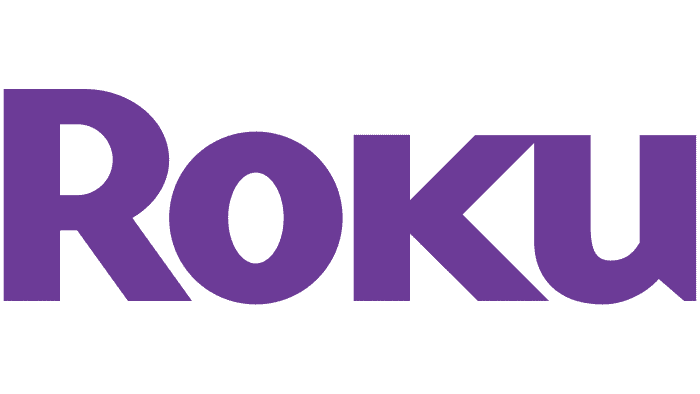

# Roku Flashback
## Brody Billings and Roy Chan
 

 

This is the submission file for Brody and Roys part 1 of the roku build.
 

A brief summary. This is a responsive app for mobile/tablet and desktop. The main use for this is a streaming app similar to Netflix, HULU and Amazon Prime.
Feel free to look at this [Google Docs](https://drive.google.com/drive/folders/12-3_ZQVZFXVWx9EEwEe8saykGqXuEGpq?usp=sharing) Folder. This folder holds all of our planning notes pre assignment completion and bugs/fixes and anything needed during the development process.
 

### More indepth info
***
This project features many compenents as listed below.

1. Vue
2. GreenSock
3. Data Loading from AJAX

## Installation
***
1. Clone it to your PC/Mac
2. Open the folder in your Visual Studio Code/Sublime Text or Atom
3. Right click on the "index" and select open in default browser
4. Enjoy!

 

## Contributing
***

1. Fork it!
2. Create your feature branch: `git checkout -b my-new-feature`
3. Commit your changes: `git commit -am 'Add some feature'`
4. Push to the branch: `git push origin my-new-feature`
5. Submit a pull request :D

 

## Credits
***
HTML markup/outline [W3C](https://validator.w3.org/)
 
CSS Animation help [MDN Web Docs](https://developer.mozilla.org/en-US/)
 
JS Animation help [GreenSock](https://greensock.com/)
 
JS help from in class demonstrations and previous assignments.
 
VUE.JS help and documentation [VUE](https://vuejs.org/)

## License
***
MIT